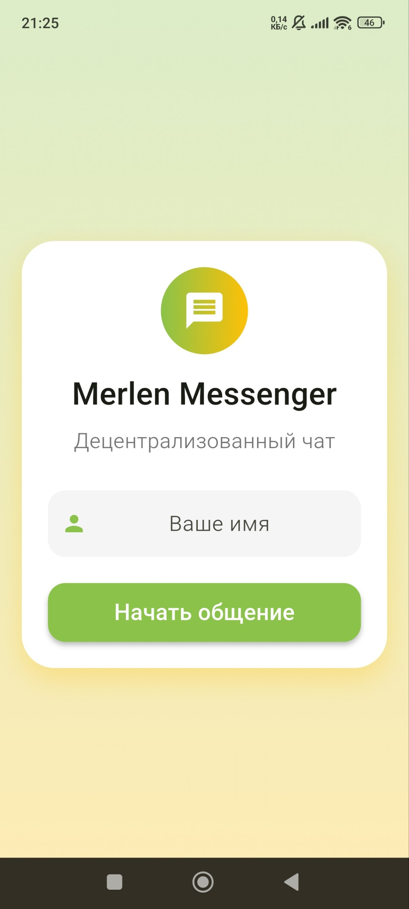
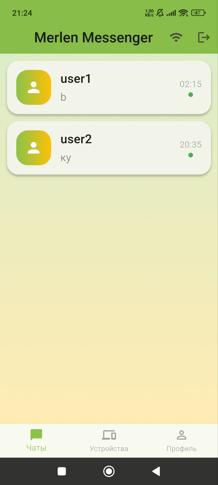
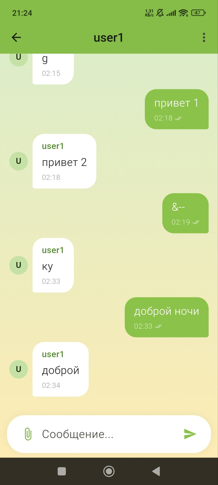
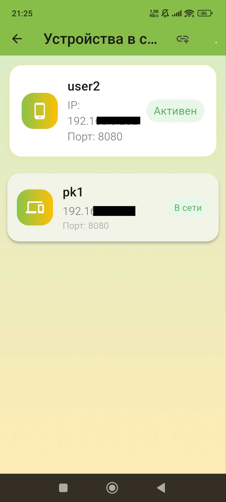
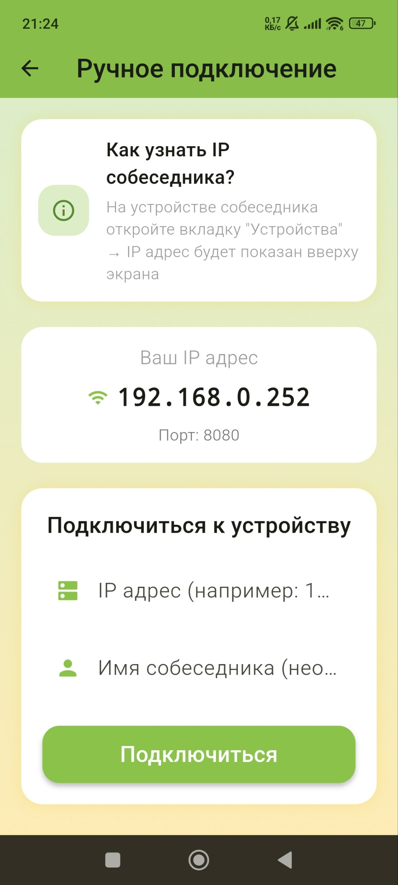
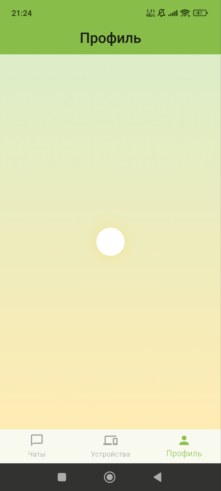

<div align="center">
  
# 🚀 Merlen Messenger

**Децентрализованный P2P мессенджер для локальных сетей**

[](https://flutter.dev)
[](https://dart.dev)
[](#)
[](LICENSE)


**Общайтесь без интернета. Без серверов. Без границ.**

</div>

---

## 📖 О проекте

**Merlen Messenger** — это децентрализованный мессенджер, который работает **без доступа к интернету**. Всё общение происходит напрямую между устройствами в одной Wi-Fi сети.

### 🎯 Почему Merlen Messenger?

| Проблема | Решение |
|----------|---------|
| ❌ Нет интернета в университете/офисе | ✅ Общайтесь через локальную сеть |
| ❌ Зависимость от серверов и облачных сервисов | ✅ Полная децентрализация |
| ❌ Риск утечки данных на сторонние сервера | ✅ Данные только на ваших устройствах |
| ❌ Сложность настройки | ✅ Просто "введите имя и общайтесь" |

---

## ✨ Возможности

<table>
<tr>
<td width="50%">

### 🔍 **Поиск устройств**
- Автоматическое сканирование сети
- Обнаружение всех пользователей в Wi-Fi
- Отображение онлайн/офлайн статуса

### 🔗 **Ручное подключение**
- Обход клиентской изоляции в сетях вузов/офисов
- Подключение по IP адресу
- Идеально для корпоративных сетей

</td>
<td width="50%">

### 💬 **Обмен сообщениями**
- Мгновенная доставка
- Статусы: отправлено/доставлено
- История переписки

### 📱 **Кроссплатформенность**
- Android 8.0+
- Windows 10/11
- Одинаковый интерфейс

</td>
</tr>
</table>

---

## 🖼️ Скриншоты

<div align="center">

| Авторизация | Главный экран | Чат |
|-------------|---------------|-----|
|  |  |  |

| Поиск устройств | Ручное подключение | Профиль |
|-----------------|---------------------|---------|
|  |  |  |

</div>

---

## 🚀 Установка

### 📱 Android

| Способ | Инструкция |
|--------|-------------|
| **APK файл** | 1. Скачайте `app-release.apk` из [Releases](https://github.com/DrD-media/Merlen_messenger/releases)<br>2. Откройте файл на телефоне<br>3. Разрешите установку из неизвестных источников<br>4. Готово! |
| **Через код** | `flutter build apk --release` |

### 🖥️ Windows

| Способ | Инструкция |
|--------|-------------|
| **ZIP архив** | 1. Скачайте `MerlenMessenger_Windows.zip` из [Releases](https://github.com/DrD-media/Merlen_messenger/releases)<br>2. Распакуйте в любую папку<br>3. Запустите `merlen_messenger_clean.exe` |
| **Через код** | `flutter build windows --release` |

---

## 🛠️ Разработка

### Требования

- Flutter 3.10.6+
- Dart 3.0.0+
- Android Studio / VS Code
- JDK 17 (для Android сборки)

### Клонирование и сборка

```bash
# Клонировать репозиторий
git clone https://github.com/DrD-media/Merlen_messenger.git
cd Merlen_messenger

# Установить зависимости
flutter pub get

# Запустить на устройстве
flutter run

# Собрать APK
flutter build apk --release

# Собрать Windows приложение
flutter build windows --release
```

## 📂 Структура проекта

lib/
├── main.dart                    # Точка входа
├── models/                      # Модели данных
│   ├── user.dart               # Пользователь
│   ├── message.dart            # Сообщение
│   └── peer.dart               # Устройство в сети
├── providers/                   # Управление состоянием
│   ├── auth_provider.dart      # Авторизация
│   ├── chat_provider.dart      # Сообщения и чаты
│   └── network_provider.dart   # Сеть и WebSocket
├── screens/                     # Экраны
│   ├── splash_screen.dart      # Загрузка
│   ├── auth_screen.dart        # Вход
│   ├── home_screen.dart        # Главный
│   ├── chat_screen.dart        # Чат
│   ├── network_screen.dart     # Поиск устройств
└── └── manual_connect_screen.dart # Ручное подключение

## 📡 Как это работает

<div align="center">
┌─────────────────┐         Wi-Fi         ┌─────────────────┐
│                 │                       │                 │
│   📱 Алиса      │ ◄───────────────────► │   📱 Боб        │
│   192.168.1.100 │                       │   192.168.1.101 │
│                 │                       │                 │
│  WebSocket:8080 │                       │  WebSocket:8080 │
└─────────────────┘                       └─────────────────┘
</div>

1. Обнаружение: Приложение сканирует подсеть (192.168.1.1-254) в поиске других устройств
2. Соединение: WebSocket подключение напрямую к IP собеседника (порт 8080)
3. Обмен: Сообщения передаются в JSON формате
4. Хранение: Вся история сохраняется локально на устройстве

## 📄 Лицензия

Распространяется под лицензией MIT. Смотрите файл LICENSE для деталей.

<div align="center">
https://img.shields.io/badge/GitHub-DrD--media-181717?logo=github
https://img.shields.io/badge/Telegram-@Merlen-26A5E4?logo=telegram

⭐ Поставьте звезду, если проект вам полезен! ⭐
</div>

## 📋 История версий
v1.0.2 (2024-04-16) Текущая
Компонент	Изменения
Новый функционал	➕ Ручное подключение по IP адресу
Новый функционал	➕ Экран ручного подключения
Улучшение	🔧 Оптимизирован поиск устройств
Улучшение	🔧 Добавлена иконка приложения
Исправление	🐛 Исправлена потеря сообщений при выходе
v1.0.1 (2024-04-15)
Компонент	Изменения
Новый функционал	➕ Автоматический поиск устройств
Новый функционал	➕ Статусы сообщений (отправлено/доставлено)
Улучшение	🔧 Улучшен UI/UX
Улучшение	🔧 Добавлены градиентные фоны
v1.0.0 (2024-04-14) Первый релиз
Компонент	Изменения
Базовый функционал	✅ Базовая регистрация пользователей
Базовый функционал	✅ Отправка и получение сообщений
Базовый функционал	✅ Локальное хранение истории
Базовый функционал	✅ WebSocket сервер на порту 8080

## 🗺️ Планы развития

Улучшение функционала и стабильности

## 🤝 Как внести вклад

1. Форкните репозиторий

2. Создайте ветку (git checkout -b feature/amazing-feature)

3. Зафиксируйте изменения (git commit -m 'Add amazing feature')

4. Отправьте (git push origin feature/amazing-feature)

5. Откройте Pull Request